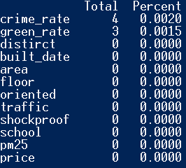
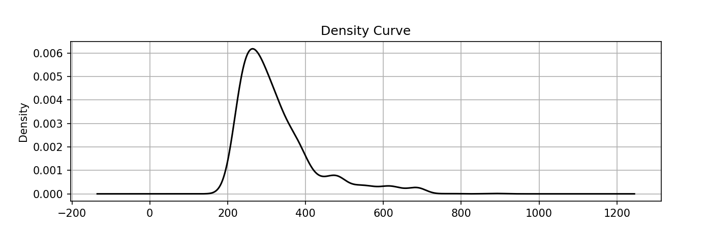

# DSC-HousePrice


## 数据导入
``` python
import pandas as pd
data = (pd.read_csv('house_train.csv')).drop('id',axis=1)
```

使用pd.read_csv方法导入数据集。

## 统计概况
该数据集包含：
* 2000处房产的12项属性
* 房产均价约为324.8
* 房产平均面积为81.5

## 缺失值的检测与处理
### 查看缺失率
```python
total =  data.isnull().sum().sort_values(ascending=False)
null_percent = (data.isnull().sum()/data.isnull().count()).sort_values(ascending=False)
missing_data =  pd.concat([total,null_percent],axis=1,keys=['Total','Percent'])
print(missing_data)
```


查看特征数据的缺失率,发现只有"green_rate"和"crime_rate"两项存在个别数据缺失的情况。

### 处理缺失值
```python
means = data.mean()
data = data.fillna(means)
```

使用dataframe的fillna()方法处理缺失值，用数据均值进行填充。

## 特征编码
针对"floor"和"built_date"两种字符串类型特征，需要实施特征编码操作来将其转化为数字类型，以便后续分析。
```python

import  sklearn.preprocessing as pre
feature_encoder_floor = pre.LabelEncoder()
floor =data['floor']
feature_encoder_floor.fit(floor)
data['floor'] = feature_encoder_floor.transform(floor)

feature_encoder_built_date = pre.LabelEncoder()
built_date =data['built_date']
feature_encoder_built_date.fit(built_date)
# print(feature_encoder_built_date.classes_)
data['built_date'] = feature_encoder_built_date.transform(built_date)
```

使用sklearn中包含的LabelEncode编码器进行编码。先对非数字类型的特征值进行分类，在按类别转换为对应数字，完成特征编码。

## 异常值检测
### 绘制密度曲线
```python
import matplotlib.pyplot as plt 
fig = plt.figure(figsize = (10,6)) 
fig.add_subplot(2,1,1)
data['price'].plot(kind='kde',grid=True, style='-k',title='Density Curve')
```


绘制出价格特征的频率密度曲线，曲线形态类似正太曲线，但是在高价格区间数据密度较为分散。

### 3δ方法
```python
new_data = data.copy()
for col in data.columns:
    ser = data[col]
    mean = data[col].mean()
    std = data[col].std()

    ser_c =  ser [ np.abs(ser - mean) <= 3 *std]
    ser_e =  ser [ np.abs(ser - mean) > 3 *std]
    new_data[col] = ser_c
data = new_data.dropna()
```

使用3δ对所有特征进行异常值处理。对于高出或低于三倍标准差的数据实施剔除操作。

## 特征间相关性分析
```python
correlation_matrix = data.corr()
```

先求出所有特征间的相关性矩阵，为后续相关性分析作准备。
### 相关系数热图
```python
import seaborn as sb
f, ax = plt.subplots(figsize=(9, 6))
ax = sb.heatmap(correlation_matrix,annot = True , fmt ='.1f')
f.tight_layout()
plt.show()
```

使用seaborn的绘制热图功能配合matplotlib进行热图绘制，结果如下。


* 从热图上看,房产面积, 交通便利程度,抗震水平,周边学校数,犯罪率,pm2.5水平和价格之间存在 正相关(+) 关系. 
* 从负相关(-) 关系上看,楼层高度,建成日期和价格呈负相关. 

## price标准化
```python
scaler = pre.StandardScaler()
col = 'price'
data[col] = scaler.fit_transform(data[[col]])
```
使用sklearn中包含的StandardScaler对价格特征进行标准化。即对于价格特征中的每一个数据'x'进行如下变换。

$$ x = \frac{x - \text{mean}}{\text{standardDeviation}} $$

## price离散化
```python
data_scaled = data.copy()
k = 10
bin = [1.0*i/k for i in range(k + 1) ] 
bin = data.price.describe(percentiles=bin)[4:4+k+1]
bin[0] = bin[0] * (1-1e-10)
data_scaled['price_discretized'] = pd.cut(data['price'],bin,labels=range(k))
frec = data_scaled.groupby('price_discretized')['price_discretized'].count()
```
使用等宽离散化的方式对'price'特征实施处理。分箱参数k=10，故离散后的数值有10个。离散化操作将连续的浮点型'price'特征转化成了离散的整数型特征。


## 三个重要特征
```python
from sklearn.feature_selection import SelectKBest
from sklearn.feature_selection import f_regression

X = data_scaled.drop(['price','price_discretized'], axis=1)  # 除去目标特征和标准化后的目标特征

y = data_scaled['price']
selector = SelectKBest(score_func=f_regression, k=3)
selector.fit(X, y)

selected_features_indices = selector.get_support(indices=True)
selected_features = X.columns[selected_features_indices]
print("与房价(price)相关性最高的三个特征是:", selected_features)
```

使用单变量线性回归方法,配合sklearn中包含的SelectKBest和f_regression从数据中过滤出与'price'特征相关性最高的三个特征。
### 运行结果


根据程序运行结果，与房价'price'相关性最高的三个特征是:'area','crime_rate'和'pm24'。