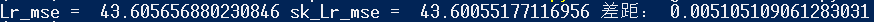

# 实验四：回归算法实现

## 线性回归

### 代码解析
```python
import numpy as np
class LRegression:
    #初始化参数，k为斜率，b为截距，a为学习率，n为迭代次数
    def __init__(self,a,n):
        self.k = None
        self.b=None
        self.a=a
        self.n=n
    
    # 多元线性回归
    #梯度下降法迭代训练模型参数
    def fit(self,X,y):
        # 输入合法性检测
        X = np.array(X)
        if (X.ndim != 2) : 
            print("ndim error!")
            return
        X_shape = np.shape(X)[1]       

        # 为参数k,b赋初值
        self.k = np.zeros(X_shape)
        self.b = 0
        
        #计算总数据量
        m=len(X)
        #梯度 
        b_grad = 1
        k_grad = np.ones(X_shape)
        #循环n次
        for _ in range ( self.n):
            b_grad=0
            k_grad=np.zeros(X_shape)
            #计算梯度的总和再求平均
            for j in range(m):
                #计算所有 ki*x 的和
                kXj_sum = 0
                for kk in range(X_shape):
                    kXj_sum += ((self.k[kk]*X[j][kk]))
                #计算每一个ki的梯度
                for ii in range(X_shape):
                    k_grad[ii] += (1/m)*((kXj_sum+self.b)-y[j])*X[j][ii]
                #计算b的梯度
                b_grad += (1/m)*((kXj_sum+self.b)-y[j])
```
    上述代码用于求解参数b,k对应的梯度,公式如下：
    b_grad = (1/n) * ∑(hθ(xᵢ) - yᵢ)
    k_grad[i] = (1/n) * ∑((hθ(xᵢ) -yᵢ) * xᵢ)
```python
            #更新k,b
            self.b=(1-self.a)*self.b-(self.a*b_grad)
            self.k=(1-self.a)*self.k-(self.a*k_grad)
```
    通过求得的梯度更新参数,公式如下：
    b = b - α * b_grad
    k[i] = b - α * k_grad[i]
```python
        # 返回参数
        self.params= {'k':self.k,'b':self.b}
        return self.params    
    #预测函数
    def predict(self,X):
        # 输入合法性检测
        X = np.array(X)
        if (X.ndim != 2) : 
            print("ndim error!")
            return 
        X_shape = np.shape(X)[1] 
        res = np.zeros(len(X))
        for ii in range(len(X)):
            kXj_sum = 0
            for kk in range(X_shape):
                kXj_sum += ((self.k[kk]*X[ii][kk]))
            y_pred =kXj_sum + self.b
            res[ii] = y_pred
        return res


    # 一元线性回归
    #梯度下降法迭代训练模型参数
    def fit_one(self,x,y,k=1,b=0):
        self.k = k
        self.b = b
        #计算总数据量
        m=len(x)
        #循环n次
        for i in range(self.n):
            b_grad=0
            k_grad=0
            #计算梯度的总和再求平均
            for j in range(m):
                b_grad += (1/m)*((self.k*x[j]+self.b)-y[j])
                k_grad += (1/m)*((self.k*x[j]+self.b)-y[j])*x[j]
```
    上述代码用于求解参数b,k对应的梯度,公式如下：
    b_grad = ∂J(θ₀, θ₁)/∂θ₀ = (1/n) * ∑(hθ(xᵢ) - yᵢ)
    k_grad = ∂J(θ₀, θ₁)/∂θ₁ = (1/n) * ∑((hθ(xᵢ) -yᵢ) * xᵢ)
```python
            #更新k,b
            self.b=self.b-(self.a*b_grad)
            self.k=self.k-(self.a*k_grad)
```
    通过求得的梯度更新参数,公式如下：
    θ₀ := θ₀ - α * ∂J(θ₀, θ₁)/∂θ₀
    θ₁ := θ₁ - α * ∂J(θ₀, θ₁)/∂θ₁
```python


        self.params= {'k':self.k,'b':self.b}
        return self.params
    
    #预测函数
    def predict_one(self,x):
        y_pred =self.k * x + self.b
        return y_pred
```
LRegression类中集成了一元线性回归和多元线性回归，二者均采用“梯度下降法”实现。一元线性回归对应的方法是fit_one(x,y)和predict_one(x)。与一元线性回归不同的是，多元线性回归输入的X为一个二维数组，对应的方法为fit(X,y)和predict_one(X)。


### 一元线性回归
      采用上述一元线性回归方法对Boston数据集进行分析，并与sklearn一元线性回归方法进行性能对比。
```python
from Regression import*
import matplotlib.pyplot as plt
from sklearn.linear_model import LinearRegression
from sklearn.metrics import mean_squared_error 
from sklearn.datasets import fetch_openml 
import matplotlib.pyplot as plt

# 一元线性回归
# 导入数据集
boston = fetch_openml(name='boston', version=1)
X = boston.data.RM.values # 使用房屋平均房间数作为x
X2 =X.reshape(len(X),1)
y = boston.target.values 

# 进行回归计算
# 自制回归方法
lr=LRegression(9.5e-3,int(35e3))
lr.fit_one(X,y)
price_p = lr.predict_one(X)
mse = mean_squared_error(y,price_p)
# sklearn线性回归方法
sk_lr = LinearRegression()
sk_lr.fit(X2,y)
sk_price_p = sk_lr.predict(X2)
sk_mse = mean_squared_error(y,sk_price_p)

# 打印结果
print ('Lr_mse = ',mse,'sk_Lr_mse = ',sk_mse,'差距：',mse  -  sk_mse )
x = X
fig, ax = plt.subplots()
plt.xlim(x.min(),1.1*x.max())
ax.scatter(x,y)
ax.plot(x,price_p,color = 'red',alpha = 0.8)
ax.plot(x,sk_price_p,color = 'blue',alpha = 0.8)
ax.set_xlabel('Measured')
ax.set_ylabel('Predicted')
ax.set_title('LRegression(red) of Mine & SklearnLinRegression(blue) Comparison Chart')
plt.show()
```
      运行上述代码即可分别使用自制一元线性回归方法和sklearn一元线性回归方法对Boston数据集进行分析预测。回归自变量为房屋平均房间数，因变量为房屋平均价格。回归结果如下。

<center><span style="font-size: 8px;">图一</span></center>

<center><span style="font-size: 8px;">图二</span></center>
<p>如图所示，红色直线为自制线性回归预测结果，蓝色曲线为sklearn预测结果。可以看出二者几乎重合，代表预测结果十分相近。再结合MSE进一步分析，二者的MSE均在43.6左右，自制线性回归方法稍高，比sklearn线性回归方法的MSE高0.005左右。</p>
<p>根据上述分析，可以认为使用梯度下降法进行一元线性回归的效果是很好的。</p>


### 多元线性回归

      采用上述一元线性回归方法对Boston数据集进行分析，并与sklearn一元线性回归方法进行性能对比。
```python
from Regression import*
import matplotlib.pyplot as plt
from sklearn.linear_model import LinearRegression
from sklearn.metrics import mean_squared_error 
from sklearn.datasets import fetch_openml 
import matplotlib.pyplot as plt

# 导入数据集
boston = fetch_openml(name='boston', version=1)
X = boston.data.RM.values.astype(np.float64)
X2 = boston.data.values .astype(np.float64)# 使用CRIM-LSTAT作为X(全部特征)
y = boston.target.values 

# 进行回归计算
# 自制回归方法
lr=LRegression(6.3e-6,int(30e3))
lr.fit(X2,y)
price_p = lr.predict(X2)
mse = mean_squared_error(y,price_p)
# sklearn线性回归方法
sk_lr = LinearRegression()
sk_lr.fit(X2,y)
sk_price_p = sk_lr.predict(X2)
sk_mse = mean_squared_error(y,sk_price_p)

# 打印结果
print ('Lr_mse = ',mse,'sk_Lr_mse = ',sk_mse,'差距：',mse  -  sk_mse )
x = X
fig, ax = plt.subplots()
plt.xlim(x.min(),1.1*x.max())
ax.scatter(x,y,alpha=0.2)
ax.scatter(x,price_p,color = 'red',alpha = 0.8)
ax.scatter(x,sk_price_p,color = 'blue',alpha = 0.8)
ax.set_xlabel('Measured')
ax.set_ylabel('Predicted')
ax.set_title('LRegression(red) of Mine & SklearnLinRegression(blue) Comparison Chart')
plt.show()
```
      运行上述代码即可分别使用自制多元线性回归方法和sklearn多元线性回归方法对Boston数据集进行分析预测。回归自变量为数据集中全部十三种特征，因变量为房屋平均价格。回归结果如下。

<center><span style="font-size: 8px;">图三</span></center>

<center><span style="font-size: 8px;">图四</span></center>
<p>13元线性回归结果如图所示，红色点为自制线性回归预测结果，深蓝色点为sklearn预测结果。可以看出二者重合度较大，代表预测结果相近。再结合MSE进一步分析，sklearn方法的mse约为22，自制线性回归方法较高，约为34，比sklearn线性回归方法的MSE高12左右。</p>
<p>根据上述分析，上述使用梯度下降法进行的多元线性回归能够在一定程度上反应源数据的多元关系。考虑到特征维度较大(13维特征)，总体回归效果尚可。</p>

## 逻辑回归

### 代码解析
```python
class LogisticRegression:
    def __init__(self, lr=0.01, n=1000):
        self.learning_rate = lr
        self.num_iterations =n 
        self.weights = None
        self.bias = None

    def fit(self, X, y):
        num_samples, num_features = X.shape

        # 初始化权重和偏置
        self.weights = np.zeros(num_features)
        self.bias = 0

        # 梯度下降
        for _ in range(self.num_iterations):
            linear_model = (np.dot(X, self.weights)) + self.bias
            y_pred = sigmoid(linear_model)

            dw = (1 / num_samples) * np.dot(X.T, (y_pred - y))
            db = (1 / num_samples) * np.sum(y_pred - y)

            self.weights -= self.learning_rate * dw
            self.bias -= self.learning_rate * db
```
上述代码用梯度下降法迭代更新参数：
$$\mathbf{w}_{t+1} = \mathbf{w}_t - \alpha \nabla J(\mathbf{w}_t)$$  
```python
    def predict_prob(self, X):
        linear_model = np.dot(X, self.weights) + self.bias
        y_pred = sigmoid(linear_model)
        return y_pred

    def predict(self, X, threshold=0.5):
        y_pred_prob = self.predict_prob(X)
        y_pred = np.zeros_like(y_pred_prob)
        y_pred[y_pred_prob >= threshold] = 1
        return y_pred

# 激活函数
def sigmoid(x):
    if len(x) <=1:
        if x>0:
            return 1.0/(1.0+np.exp(-x))
        else:
            return np.exp(x)/(1.0+np.exp(x))
    else :
        for i in range (len (x)):
         if x[i]>0:
            x[i] = 1.0/(1.0+np.exp(-x[i]))
         else:
            x[i] =  np.exp(x[i])/(1.0+np.exp(x[i]))   

        return x
```
上述sigmoid函数为logistic回归的激活函数，数学公式为：$$\sigma(z) = \frac{1}{1 + e^{-x}}$$
### 测试多元逻辑回归

```python
from Regression import LogisticRegression
import sklearn.datasets  
from sklearn.linear_model import LogisticRegression as sk_LogisticRegression
from sklearn.metrics import accuracy_score

# 导入数据集
bc = sklearn.datasets.load_breast_cancer()
X = bc.data
y =  bc.target

# 创建Logistic回归模型
logreg = LogisticRegression(lr= 5e-2,n=int(4e3))
sk_logreg = sk_LogisticRegression()

# 训练模型
logreg.fit(X, y)
sk_logreg.fit(X, y)

# 预测测试集
y_pred = logreg.predict(X)
sk_y_pred = sk_logreg.predict(X)

# 计算预测准确率
accuracy = accuracy_score(y, y_pred)
sk_accuracy = accuracy_score(y, sk_y_pred)
print("Accuracy:", accuracy)
print("sk_Accuracy:", sk_accuracy)
```
上述代码使用自制逻辑回归方法和sklearn逻辑回归方法对乳腺癌数据集进行了回归分析。结果如下：
<center>
<p><span style="font-size: 8px;">图五</span></p></center>
<p>逻辑回归结果如图所示，Accuracy点为自制回归预测结果准确率，sk_Accuracy为sklearn预测结果准确率。可以看出二者差距较小。自制线性回归方法约为92％，比sklearn线性回归方法的MSE低2％左右。</p>
<p>根据上述分析，上述使用梯度下降法进行的逻辑回归能够在较大程度上进行逻辑预测。总体回归效果较好。</p>


