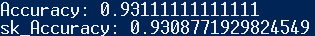
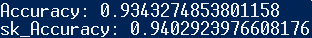
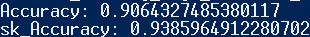

# 数据科学导论作业--分类问题
## KNN
### 代码解析
```python
class KNN :
    def __init__(self,n_neighbors = 5) -> None:
        self.X = None
        self.y = None
        self.fited = False
        self.k = n_neighbors

    # KNN无需训练，这里只作关联数据 
    def fit(self,X,y):
        self.X = X
        self.fited = True
        self.y = y
    
    # 对一个数据点进行分类
    def predict_one (self,x):
        # 计算距离
        distances = np.sqrt(np.sum(np.square(self.X - x), axis=1))
```
这里使用欧氏距离公式计算x与其他所有点的距离,
欧氏距离是空间中两点之间的距离，如果有两个点分别是 $(x_1, x_2, ..., x_n)$ 和 $(y_1, y_2, ..., y_n)$，那么它们之间的欧氏距离 $ d $ 可以用以下公式表示：
$$ d = \sqrt{\sum_{i=1}^{n} (y_i - x_i)^2} $$
这个公式可以计算KNN算法中临近点的距离。
```python
        # 计算距离矩阵
        len_dis = len(distances)
        # 得到distances数目
        labels = []
        # 存储标签
        for i in range(0, self.k):
            min_value = distances[i]
            min_value_idx = i
            for j in range(i + 1, len_dis):
                if distances[j] < min_value:
                    min_value = distances[j]
                    min_value_idx = j
            distances[i], distances[min_value_idx] = distances[min_value_idx], distances[i]
            labels.append(self.y[min_value_idx])
        # 选择排序挑选出前k个最值
        # 用labels存储前k个最小距离的标签
        C = labels[0]
        max_count = 0
        for label in labels:
            count = labels.count(label)
            if count > max_count:
                max_count = count
                C = label
        # 求前k个label中，重复次数最多的label，并返回
        return C
    
    # 对一组点进行分类k
    def predict(self,X_t):
        if not self.fited :
            print('err') 
            return None
        res = []
        for x in X_t:
           res.append (self.predict_one(x)) 
            
        return np.array(res)
``` 

### 性能测试
```python
from Classifycation import * 
import sklearn.datasets  
from sklearn.linear_model import LogisticRegression as sk_LogisticRegression
from sklearn.metrics import accuracy_score
from sklearn.model_selection import train_test_split
from sklearn.neighbors import KNeighborsClassifier as sk_KNN

# 导入数据集
bc = sklearn.datasets.load_breast_cancer()
X = bc.data
y =  bc.target


# 创建Logistic回归模型
knn = KNN(n_neighbors=7) # k = 7
sk_knn = sk_KNN() # sklearn knn 默认k值为5

# 划分数据集100次 ,求平均准确率
n = 100
avg_accuracy = 0
sk_avg_accuracy = 0
for i in range(n):
    X_train ,X_test , y_train,y_test = train_test_split(X,y,test_size=0.3)
    # 训练模型
    knn.fit(X_train, y_train)
    sk_knn.fit(X_train, y_train)

    # 预测测试集
    y_pred = knn.predict(X_test)
    sk_y_pred = sk_knn.predict(X_test)

    # 计算预测准确率
    accuracy = accuracy_score(y_test, y_pred)
    sk_accuracy = accuracy_score(y_test, sk_y_pred)
    avg_accuracy += accuracy
    sk_avg_accuracy +=sk_accuracy
avg_accuracy /= n
sk_avg_accuracy /= n

print("Accuracy:", avg_accuracy)
print("sk_Accuracy:", sk_avg_accuracy)
```
上述代码使用自制KNN方法和sklearnKNN方法对乳腺癌数据集进行了分类。准确率结果如下：
<center>
<p><span style="font-size: 8px;">图一</span></p></center>
<p>分类结果如图所示，Accuracy点为自制KNN预测结果准确率，sk_Accuracy为sklearn预测结果准确率。可以看出二者几乎一致。自制KNN方法约为93.1％，比sklearn线性回归方法的准确率高0.03％左右。</p>
<p>根据上述分析，上述使用KNN法进行的分类能够在较大程度上进行预测。总体分类效果较好。</p>


## 朴素贝叶斯
### 代码解析
由于需要处理连续的特征输入，这里使用高斯分布概率密度函数对特征的概率密度进行了建模。
```python
class GNB: # 高斯分布处理连续特征
    def __init__(self) -> None:
        # 高斯分布参数
        self.mean = 0
        self.std = 0
        self.mean_0 = 0
        self.mean_1 = 0
        self.std_0 =0
        self.std_1 =0
        # 先验概率
        self.p0_prior = 0
        self.p1_prior = 0
        # has fitted
        self.fitted = False

    # 训练
    def  fit(self,X,y):
        self.fitted = True
        # 计算先验概率
        training_mat, training_labels = X,y
        feature_size = len(training_mat[0])
        training_size = len(training_mat)
        self.p1_prior = (sum(training_labels) + 1) / (float(training_size) + 2)
        self.p0_prior = 1 - self.p1_prior
        # 计算条件概率
        self.mean=np.mean(X,axis=0)
        self.std=np.std(X,axis=0)
        i1,i0 = 0,0 
        # 类别为1的特征点集合
        features_1 = [0]*training_size 
        # 类别为0的特征点集合
        features_0 = [0]*training_size
        for i in range(training_size):
            if training_labels[i] == 1:
                features_1[i1] =  training_mat[i]
                i1+=1
            else:
                features_0[i0] =  training_mat[i]
                i0+=1
        features_0 = np.array(features_0[:i0])
        features_1 = np.array(features_1[:i1])
        # 计算条件概率
        # 均值
        self.mean_1 = np.mean(features_1,axis=0)
        self.mean_0 = np.mean(features_0,axis=0)
        # 方差
        self.std_0 = np.std(features_0,axis=0)
        self.std_1 = np.std(features_1,axis=0)

    # 预测
    def predict(self,X_t):
        if not self.fitted :
            print('err') 
            return None
        res = []
        for x in X_t: 
           res.append (self.predict_one(x))  
        return np.array(res) 

    # 对单个特征点进行分类
    def predict_one (self,test_data):
        feature_size = len(test_data)
        # 计算目标函数
        p1_pred, p0_pred = self.p1_prior, self.p0_prior    
        # 分别计算属于类1和类0的概率
        for i in range(feature_size):
                p1_pred *= GNB.normal_dist(test_data[i],self.mean_1[i],self.std_1[i])                
                p0_pred *= GNB.normal_dist(test_data[i],self.mean_0[i],self.std_0[i])
```
以上通过条件概率和先验概率来计算特征点属于不同类别的概率。对于类别1和类别0。给定一个特征向量 $ \mathbf{x} $，计算它属于类别1和类别0的概率。

 $ P(C_1) $ 和 $ P(C_0) $ 分别表示类别1和类别0的先验概率，$ P(\mathbf{x}|C_1) $ 和 $ P(\mathbf{x}|C_0) $ 分别表示给定类别1和类别0的条件概率。则根据贝叶斯定理，我们可以计算特征点 $ \mathbf{x} $ 分别属于类别1和类别0的后验概率如下：

$${P(\mathbf{x})}\times P(C_1|\mathbf{x}) = {P(\mathbf{x}|C_1) \times P(C_1)} $$

$$ {P(\mathbf{x})}\times P(C_0|\mathbf{x}) = {P(\mathbf{x}|C_0) \times P(C_0)} $$

现假设特征之间是独立的，因此条件概率可以分解为特征的单独概率的乘积：

$$ P(\mathbf{x}|C_i) = P(x_1|C_i) \times P(x_2|C_i) \times \ldots \times P(x_n|C_i) $$

其中 $(x_1, x_2, \ldots, x_n ) $是特征向量 $ \mathbf{x} $ 的各个分量。

上述程序使用这些公式对后验概率进行了计算。


```python
        if p1_pred > p0_pred:
            return 1
        else:
            return 0

    # 高斯分布概率密度公式
    @staticmethod 
    def normal_dist(x , mean , sd):
        prob_density = (1/sd*np.sqrt(2*np.pi)) * np.exp(-0.5*((x-mean)/sd)**2)
        return prob_density
```
上述高斯分布概率密度函数可以表示为：
$$ f(x|mean, sd) = \frac{1}{\sqrt{2\pi}sd} \exp\left(-\frac{(x - mean)^2}{2sd^2}\right) $$
其中，$ x $ 是随机变量，$ mean  $ 是均值，$ sd $ 是标准差。这个公式描述了给定均值和标准差的高斯分布中，随机变量 $ x $ 取特定值的概率密度。

### 性能测试
```python
from Classifycation import * 
import sklearn.datasets  
from sklearn.metrics import accuracy_score
from sklearn.model_selection import train_test_split
from sklearn. naive_bayes import GaussianNB as sk_NB

# 导入数据集
bc = sklearn.datasets.load_breast_cancer()
X = bc.data
y =  bc.target

# 创建Naive Bayers回归模型
nb = GNB()
sk_nb = sk_NB() # sklearn Naive Bayes 

# 划分数据集100次 ,求平均准确率
n = 100
avg_accuracy = 0
sk_avg_accuracy = 0
for i in range(n):
    X_train ,X_test , y_train,y_test = train_test_split(X,y,test_size=0.3)
    # 训练模型
    nb.fit(X_train, y_train)
    sk_nb.fit(X_train, y_train)

    # 预测测试集
    y_pred = nb.predict(X_test)
    sk_y_pred = sk_nb.predict(X_test)

    # 计算预测准确率
    accuracy = accuracy_score(y_test, y_pred)
    sk_accuracy = accuracy_score(y_test, sk_y_pred)
    avg_accuracy += accuracy
    sk_avg_accuracy +=sk_accuracy
avg_accuracy /= n
sk_avg_accuracy /= n
print("Accuracy:", avg_accuracy)
print("sk_Accuracy:", sk_avg_accuracy)
```
上述代码使用自制朴素贝叶斯方法和sklearn朴素贝叶斯方法对乳腺癌数据集测试集进行了分类。结果如下：
<center>
<p><span style="font-size: 8px;">图二</span></p></center>
<p>分类结果如图所示，Accuracy点为自制朴素贝叶斯预测结果准确率，sk_Accuracy为sklearn预测结果准确率。可以看出二者几乎一致。自制KNN方法约为93.4％，比sklearn线性回归方法的准确率低1％左右。</p>
<p>根据上述分析，上述使用朴素贝叶斯法进行的分类能够在较大程度上进行预测。总体分类效果较好。</p>


## 逻辑回归
### 代码解析
```python
class LogisticRegression:
    def __init__(self, lr=0.01, n=1000):
        self.learning_rate = lr
        self.num_iterations =n 
        self.weights = None
        self.bias = None

    def fit(self, X, y):
        num_samples, num_features = X.shape

        # 初始化权重和偏置
        self.weights = np.zeros(num_features)
        self.bias = 0

        # 梯度下降
        for _ in range(self.num_iterations):
            linear_model = (np.dot(X, self.weights)) + self.bias
            y_pred = sigmoid(linear_model)

            dw = (1 / num_samples) * np.dot(X.T, (y_pred - y))
            db = (1 / num_samples) * np.sum(y_pred - y)

            self.weights -= self.learning_rate * dw
            self.bias -= self.learning_rate * db
```
上述代码用梯度下降法迭代更新参数：
$$\mathbf{w}_{t+1} = \mathbf{w}_t - \alpha \nabla J(\mathbf{w}_t)$$  
```python
    def predict_prob(self, X):
        linear_model = np.dot(X, self.weights) + self.bias
        y_pred = sigmoid(linear_model)
        return y_pred

    def predict(self, X, threshold=0.5):
        y_pred_prob = self.predict_prob(X)
        y_pred = np.zeros_like(y_pred_prob)
        y_pred[y_pred_prob >= threshold] = 1
        return y_pred

# 激活函数
def sigmoid(x):
    if len(x) <=1:
        if x>0:
            return 1.0/(1.0+np.exp(-x))
        else:
            return np.exp(x)/(1.0+np.exp(x))
    else :
        for i in range (len (x)):
         if x[i]>0:
            x[i] = 1.0/(1.0+np.exp(-x[i]))
         else:
            x[i] =  np.exp(x[i])/(1.0+np.exp(x[i]))   

        return x
```
上述sigmoid函数为logistic回归的激活函数，数学公式为：$$\sigma(z) = \frac{1}{1 + e^{-x}}$$
### 测试多元逻辑回归

```python
from Classifycation import * 
import sklearn.datasets  
from sklearn.metrics import accuracy_score
from sklearn.model_selection import train_test_split
from sklearn.linear_model import LogisticRegression as sk_LogisticRegression

# 导入数据集
bc = sklearn.datasets.load_breast_cancer()
X = bc.data
y =  bc.target

# 创建Logistic回归模型
logreg = LogisticRegression(lr= 5e-2,n=int(4e3))
sk_logreg = sk_LogisticRegression()

# 划分数据集100次 ,求平均准确率
n = 100
avg_accuracy = 0
sk_avg_accuracy = 0
for i in range(n):
    X_train ,X_test , y_train,y_test = train_test_split(X,y,test_size=0.3)
    # 训练模型
    logreg.fit(X_train, y_train)
    sk_logreg.fit(X_train, y_train)

    # 预测测试集
    y_pred = logreg.predict(X_test)
    sk_y_pred = sk_logreg.predict(X_test)

    # 计算预测准确率
    accuracy = accuracy_score(y_test, y_pred)
    sk_accuracy = accuracy_score(y_test, sk_y_pred)
    avg_accuracy += accuracy
    sk_avg_accuracy +=sk_accuracy
avg_accuracy /= n
sk_avg_accuracy /= n

print("Accuracy:", avg_accuracy)
print("sk_Accuracy:", sk_avg_accuracy)
```
上述代码使用自制逻辑回归方法和sklearn逻辑回归方法对乳腺癌数据集进行了回归分析。结果如下：
<center>
<p><span style="font-size: 8px;">图三</span></p></center>
<p>逻辑回归结果如图所示，Accuracy点为自制回归预测结果准确率，sk_Accuracy为sklearn预测结果准确率。可以看出二者差距较小。自制线性回归方法约为91％，比sklearn线性回归方法的准确率低3％左右。</p>
<p>根据上述分析，上述使用梯度下降法进行的逻辑回归能够在较大程度上进行逻辑预测。总体回归效果较好。</p>


