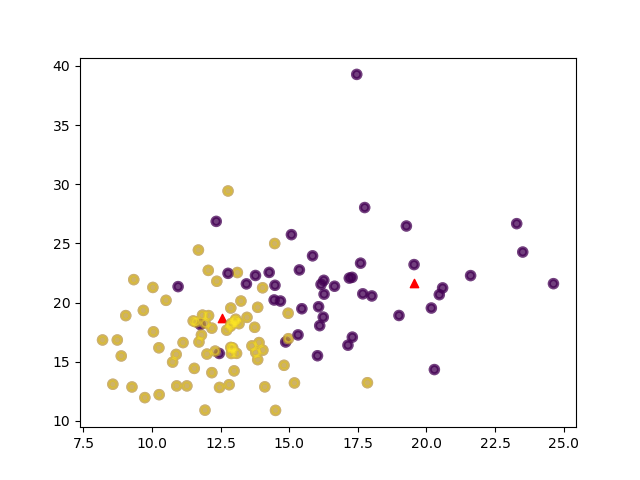
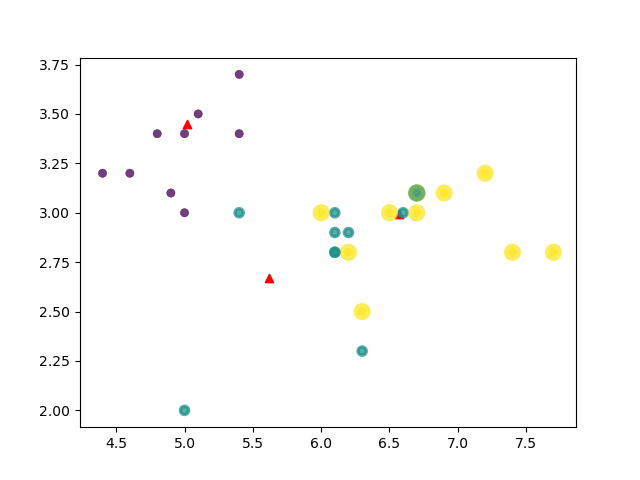
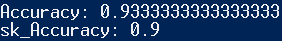

# 数据科学导论作业--聚类问题
## KMeans
### 代码解析
```python
import numpy as np
import copy

class KMeans:
    # 输入聚类数
    def __init__(self, k_num) -> None:
        self.k = k_num # 聚类数
        self.clusterCents = None # 聚类中心
```
计算欧氏距离:
$$
\sqrt{{(x_2 - x_1)}^2 + {(y_2 - y_1)}^2}
$$

```py
    @ staticmethod
    def L2(vecXi, vecXj):

        return np.sqrt(np.sum(np.power(vecXi - vecXj, 2)))
```
distMeas：距离度量函数，默认为欧氏距离计算函数

sampleTag：一维数组，存储样本对应的簇标记

clusterCents：一维数组，各簇中心

SSE: 误差平方和
```py
    #S：样本集，多维数组
    def fit(self,S):

        distMeas= KMeans.L2
        m = np.shape(S)[0] # 样本总数
        sampleTag = np.zeros(m).astype(int)
        # 随机产生k个初始簇中心
        n = np.shape(S)[1] # 样本向量的特征数
        self.clusterCents = np.mat(np.zeros((self.k,n)))
        for j in range(n):
            minJ = min(S[:,j]) 
            rangeJ = float(max(S[:,j]) - minJ)
            self.clusterCents[:,j] = np.mat(minJ + rangeJ * np.random.rand(self.k,1))
            
        sampleTagChanged = True
        SSE = 0.0
        while sampleTagChanged: # 如果没有点发生分配结果改变，则结束
            sampleTagChanged = False
            SSE = 0.0
            
```
将数据点分配到最近的聚类中心：
$$
\text{minimize} \sum_{n=1}^{N} \sum_{k=1}^{K} r_{nk} || x_n - \mu_k ||^2
$$ 
$ r_{nk}$ 是指示变量，表示数据点 $x_n$ 是否被分配到簇 k 中。
```py

            # 计算每个样本点到各簇中心的距离
            for i in range(m):
                minD = np.inf
                minIndex = -1
                # k是簇中心个数
                for j in range(self.k):
                    # S样本集，clusterCents样本中心点
                    d = distMeas(self.clusterCents[j,:],S[i,:])
                    if d < minD:
                        minD = d
                        minIndex = j
                if sampleTag[i] != minIndex: 
                    sampleTagChanged = True
                sampleTag[i] = minIndex
                SSE += minD**2
```

重新计算聚类中心：

$$
\mu_k = \frac{\sum_{n=1}^{N} r_{nk} x_n}{\sum_{n=1}^{N} r_{nk}}
$$
$\mu_k$ 是第 k 个簇的新聚类中心。
           
```py
            # 重新计算簇中心
            for i in range(self.k):
                ClustI = S[np.nonzero(sampleTag[:]==i)[0]]
                self.clusterCents[i,:] = np.mean(ClustI, axis=0)

        return sampleTag, SSE
    
    # 预测新的数据
    def  predict(self,S):
        distMeas =  KMeans.L2
        SSE = 0.0
        m = np.shape(S)[0] # 样本总数
        sampleTag = np.zeros(m).astype(int)       
        # 计算每个样本点到各簇中心的距离
        for i in range(m):
            minD = np.inf
            minIndex = -1
            # k是簇中心个数
            for j in range(self.k):
                # S样本集，clusterCents样本中心点
                d = distMeas(self.clusterCents[j,:],S[i,:])
                if d < minD:
                    minD = d
                    minIndex = j

            sampleTag[i] = minIndex
            SSE += minD**2
        
        return sampleTag  
```

由于KMeans输出的类别序号(eg. 0,1,2)可能与数据集标定的类别序号不对应，所以编写了以下静态方法对序号进行重新对应。由于不是算法的主要内容，在此略过。

```python
    @staticmethod
    def set_lable_0_1 (sampleTag , y):
        n = min(len(sampleTag),len(y))
        correct_sum = 0
        for i in range(n):
            if (sampleTag[i]==y[i]):
                correct_sum +=1
        if (correct_sum < n/2):
            sampleTag = KMeans.invert_0_1(sampleTag)
        return sampleTag
    
    @staticmethod
    def set_lable_0_1_2 (sampleTag , y):
        n = min(len(sampleTag),len(y))
        
        # class_num = KMeans.get_class_num(sampleTag+y)
        class_num = np.array([0,1,2]).astype(int)

        

        highest_correct_sum = -1
        ret = None
        for ii in class_num:
            class_num_n = copy.deepcopy(class_num)
            class_num_n = KMeans.arr_drop_num(class_num_n,ii)
            for jj in class_num_n:

                
                new_sampleTag = copy.deepcopy(sampleTag)
                new_sampleTag = KMeans.set_num(new_sampleTag,0,-1)
                new_sampleTag = KMeans.set_num(new_sampleTag,1,-2)
                new_sampleTag = KMeans.set_num(new_sampleTag,2,-3)

                new_sampleTag = KMeans.set_num(new_sampleTag,-1,ii)
                new_sampleTag = KMeans.set_num(new_sampleTag,-2,jj)
                class_num_new = copy.deepcopy(class_num)
                class_num_new = KMeans.arr_drop_num(class_num_new,ii)
                class_num_new = KMeans.arr_drop_num(class_num_new,jj)                
                new_sampleTag = KMeans.set_num(new_sampleTag,-3,class_num_new[0])
                print(new_sampleTag,ii,jj,class_num_new[0])

                correct_sum = 0
                for i in range(n):
                    if (new_sampleTag[i]==y[i]):
                        correct_sum +=1
                if (correct_sum > highest_correct_sum):
                    highest_correct_sum = correct_sum
                    ret = new_sampleTag
 
        return ret
    
    @staticmethod 
    def get_class_num(tag):
        class_num=[]
        for num in tag :
            if not KMeans.arr_has_num(class_num,num):
                class_num.append(num)
        return np.array(class_num)

    @staticmethod 
    def arr_has_num(arr, num):
        for n in arr:
            if n == num:
                return True
        return False

    @staticmethod 
    def arr_drop_num(arr, num):
        arr_1 = []
        for i in range (len(arr)):
            if (arr[i] != num ):
                arr_1.append(arr[i])            
       
        return np.array(arr_1)


    @staticmethod 
    def set_num(arr, from_ :int, to_ : int ):
        for i in range (len(arr)):
            if (arr[i] == from_ ):
                arr[i] = to_             
       
        return arr

    def switch_num(arr, a:int, b : int ):
        for i in range (len(arr)):
            if (arr[i] == a ):
                arr[i] =  b            
            elif (arr[i] == b ):
                arr[i] =  a            
       
        return arr

     

    @staticmethod
    def invert_0_1( arr ):
        for i in range (len(arr)):
            if (arr[i] == 0 ):
                arr[i] = 1 
            
            else :
                arr[i] =1
        
        return arr
```


 
### 性能测试
#### 乳腺癌数据集
```python
from Cluster import*
import matplotlib.pyplot as plt
from sklearn.cluster import KMeans as sk_KMeans
import sklearn.datasets  
from sklearn.metrics import accuracy_score
from sklearn.model_selection import train_test_split

# 导入数据集
bc = sklearn.datasets.load_breast_cancer()
X = bc.data
y =  bc.target

# 创建模型
kmeans = KMeans(2) # k = 7
sk_kmeans = sk_KMeans(2) # sklearn knn 默认k值为5

# 划分数据集100次 ,求平均准确率
n = 100
avg_accuracy = 0
sk_avg_accuracy = 0
y_pred = None
X_test = None
y_test = None
for i in range(n):
    X_train ,X_test , y_train,y_test = train_test_split(X,y,test_size=0.2)
    # 训练模型
    kmeans.fit(X_train)
    sk_kmeans.fit(X_train)

    # 预测测试集
    y_pred = KMeans.set_lable_0_1(kmeans.predict(X_test),y_test)
    sk_y_pred = KMeans.set_lable_0_1(sk_kmeans.predict(X_test),y_test)
    # y_pred = (kmeans.predict(X_test))
    # sk_y_pred =(sk_kmeans.predict(X_test))

    # print(y_pred,sk_y_pred,y_test)


    # 计算预测准确率
    accuracy = accuracy_score(y_test, y_pred)
    sk_accuracy = accuracy_score(y_test, sk_y_pred)
    avg_accuracy += accuracy
    sk_avg_accuracy +=sk_accuracy
avg_accuracy /= n
sk_avg_accuracy /= n

print("Accuracy:", avg_accuracy)
print("sk_Accuracy:", sk_avg_accuracy)

plt.scatter(kmeans.clusterCents[:,0].tolist(),kmeans.clusterCents[:,1].tolist(),c='r',marker='^')
plt.scatter(X_test[:,0],X_test[:,1],c=y_pred*100+20,linewidths=np.power(y_pred+0.5, 2),alpha=0.5)
plt.scatter(X_test[:,0],X_test[:,1],c=y_test*100+20,linewidths=np.power(y_pred+0.5, 2),alpha=0.5)
plt.show()
```


上述代码使用自制KMeans方法和sklearn-KMeans方法对乳腺癌数据集进行了回归分析。结果如下：
<center>
<p><span style="font-size: 8px;">1 自制KMeans回归结果</span></p></center>
<center>
<p><span style="font-size: 8px;">2 准确率对比</span></p></center>


<p>上图为自制KMeans算法聚类结果(只展示维度0,1)，紫色和黄色各代表一类，纯色点为预测正确的点。两个红色三角为KMeans算法中心点。</p>
<p>KMeans聚类结果如图所示，Accuracy为自制KMeans预测结果准确率，sk_Accuracy为sklearn预测结果准确率。自制线性回归方法约为80％，比sklearn线性回归方法的准确率高6％左右。</p>
<p>根据上述结果，使用自制KMeans算法能够在较大程度上进行逻辑预测。总体回归效果较好。</p>


#### Iris数据集
```python
from Cluster import*
import matplotlib.pyplot as plt
from sklearn.cluster import KMeans as sk_KMeans
import sklearn.datasets  
from sklearn.metrics import accuracy_score
from sklearn.model_selection import train_test_split

# 导入数据集
bc = sklearn.datasets.load_iris()
X = bc.data
y =  bc.target

# 创建模型
kmeans = KMeans(3) 
sk_kmeans = sk_KMeans(3) 

# 划分数据集100次 ,求平均准确率
n = 1
avg_accuracy = 0
sk_avg_accuracy = 0
y_pred = None
X_test = None
y_test = None
for i in range(n):
    X_train ,X_test , y_train,y_test = train_test_split(X,y,test_size=0.2)
    # 训练模型
    kmeans.fit(X_train)
    sk_kmeans.fit(X_train)

    # 预测测试集
    y_pred = KMeans.set_lable_0_1_2(kmeans.predict(X_test),y_test)
    sk_y_pred = KMeans.set_lable_0_1_2(sk_kmeans.predict(X_test),y_test)

    # 计算预测准确率
    accuracy = accuracy_score(y_test, y_pred)
    sk_accuracy = accuracy_score(y_test, sk_y_pred)
    avg_accuracy += accuracy
    sk_avg_accuracy +=sk_accuracy
avg_accuracy /= n
sk_avg_accuracy /= n

print("Accuracy:", avg_accuracy)
print("sk_Accuracy:", sk_avg_accuracy)

plt.scatter(kmeans.clusterCents[:,0].tolist(),kmeans.clusterCents[:,1].tolist(),c='r',marker='^')
plt.scatter(X_test[:,0],X_test[:,1],c=y_pred*100+20,linewidths=np.power(y_pred+0.5, 2),alpha=0.5)
plt.scatter(X_test[:,0],X_test[:,1],c=y_test*100+20,linewidths=np.power(y_pred+0.5, 2),alpha=0.5)
plt.show()

```


上述代码使用自制KMeans方法和sklearn-KMeans方法对Iris数据集进行了回归分析。结果如下：
<center>
<p><span style="font-size: 8px;">1 自制KMeans回归结果</span></p></center>
<center>
<p><span style="font-size: 8px;">2 准确率对比</span></p></center>

<p>上图为自制KMeans算法聚类结果(只展示维度0,1)，紫色，黄色和青色各代表一类，纯色为预测正确的点。两个红色三角为KMeans算法中心点。</p>
<p>KMeans聚类结果如图所示，Accuracy为自制KMeans预测结果准确率，sk_Accuracy为sklearn预测结果准确率。自制线性回归方法约为93％，比sklearn线性回归方法的准确率高3％左右。</p>
<p>根据上述结果，使用自制KMeans算法能够在较大程度上进行逻辑预测。总体回归效果较好。</p>


